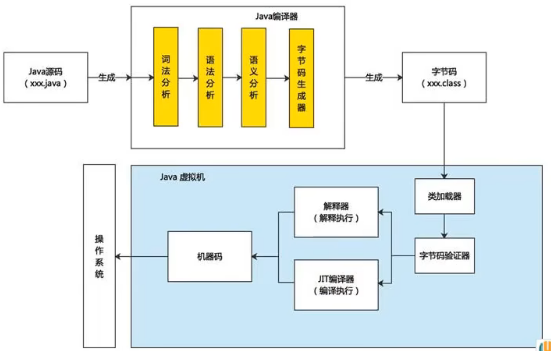

> JDK: Java Develoer's Kit
> JRE: Java Runtime Environment
> JVM: Java Virtual Machine

> JDK = JRE + 开发工具集（例如javac编译工具等）
> JRE = JVM + Java SE标准类库

> Java SE(Java Standard Edition)标准版：支持桌面级应用（如：windows下的应用程序），包括用户界面接口AWT及Swing，网络功能与国际化、图像处理能力以及输入输出支持等。
> Java EE(Java Enterprise Edition)企业版：定位在服务器的web应用开发。
> Java ME(Java Micro Edition)小型版：支持java运行在移动终端（手机、机顶盒）设备上的平台。

### 1. java程序编写和执行的过程：
* 步骤1：编写。将java代码编写在.java结尾的源文件中
* 步骤2：编译。针对.java结尾的源文件进行编译操作。格式：javac 源文件名.java [-encoding utf-8]
* 步骤3：运行。针对于编译后生成的字节码文件（.class结尾），进行解释运行。格式：java 字节码文件名
* 先编译，再运行
> windows 环境不区分大小写。

### 2. 针对步骤1编写进行说明：
```java
class HelloChina {
  public static void main(String[] args){
    System.out.println("hello,world!你好，中国！");
  }
}
```
其中：
* ① class：关键字，表示“类”，后面跟着类名。
* ② main() 方法的格式是固定的。务必记住！表示程序的入口。
  public static void main(String[] args)
* ③ java程序，是严格区分大小写的。
* ④ 从控制台输出数据的操作：
  System.out.println("输出的信息"); 输出数据之后，会换行。
  System.out.print("输出的信息"); 输出数据之后，不会换行。
* ⑤ 每一行的执行语句必须 ; 结尾。

### 3. 针对步骤2的编译进行说明。
* ① 如果编译不通过。可以考虑的问题：
  问题1：查看编译的文件名、文件路径是否书写错误。
  问题2：查看代码中是否存在语法问题。如果存在，就可能导致编译不通过。
* ② 编译以后，会生成1个或多个字节码文件。每一个字节码文件对应一个java类，并且字节码文件与类名相同。

### 4. 针对步骤3运行进行说明。
* ① 我们是针对于字节码文件对应的java类进行解释运行的，要注意区分大小写！
* ② 如果运行不通过，可以考虑的问题：
  问题1：查看解释运行的类名、字节码文件路径是否书写错误。
  问题2：可能存在运行时异常，如果：System.out.println(10/0);。

### 5. 一个源文件中可以声明多个类，但是最多只能有一个类使用public进行声明。且要求声明为public的类的类名与源文件相同。

#### 6. 如何理解 java 是半编译半解释型语言？
* java 执行流程：java源文件（.java）先通过 java 编译器编译成字节码文件（.class），由 java 类加载器将字节码文件加载到 jvm 中，jvm 处理字节码文件得到可执行的机器码，交由 cpu 执行
* java 之所以是半编译半解释型语言，其实是从 jvm 中的部分去理解：
> java 程序最初都是通过解释器（Interpreter）进行解释的(逐行解释)，当虚拟机发现某个方法或者代码块运行特别频繁，就会把这些代码认定为**热点代码**（Hot Spot Code），为了提高热点代码的执行效率，在运行时，虚拟机会把这些代码**编译成本地机器码**，并以各种手段尽可能的进行代码优化（运行时完成这个任务的后端编译器被称为即时编译器 JIT，Just In Time）
* 