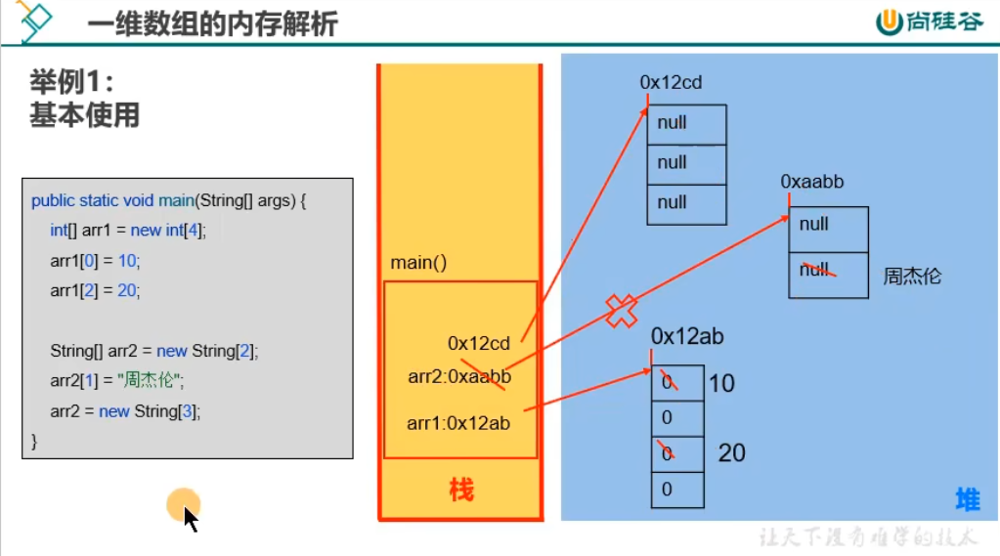
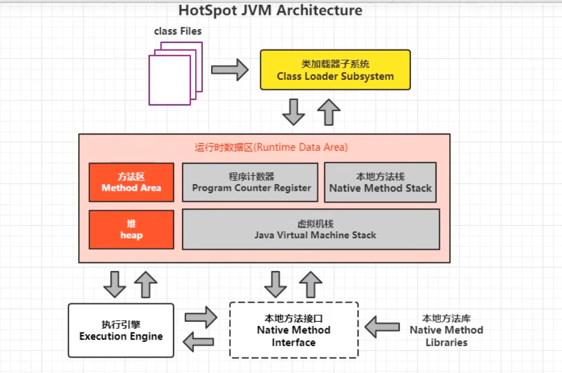

### 1. 数组的理解（Array）

> 概念：是多个相同类型数据按一定顺序的集合，并使用一个名字命名，并通过编号的方式对这些数据进行统一管理。
> 
> 简称：多个数据的组合。

Java中的容器：数组、集合框架：在内存中对多个数据的存储。

### 2. 几个相关的概念

* 数组名
* 数组的元素（即内部存储的多个元素）
* 数组的下标、角标、下角标、索引、index（即找到指定数组元素所使用的编号）
* 数组的长度（即数组容器中存储的元素的个数）

### 3. 数组的特点

* 数组中的元素在内存中是依次紧密排列的，有序的。
* 数组，属于引用数据类型的变量。数组的元素，既可以是基本数据类型，也可以是引用数据类型。
* 数组，一旦初始化完成，其长度就确定了，并且其长度不可更改。
* 创建数组对象会在内存中开辟一整块**连续的空间**。占据的空间的大小，取决于数组的长度和数组中元素的类型。

### 4. 复习：变量按照数据类型的分类

* 基本数据类型：`byte`, `short`, `int`, `long`; `float`, `double`; `char`; `boolean`
* 引用数据类型：类、数组、接口、枚举、注解、记录

### 5. 数组元素的默认初始化值的情况
注意：以数组的动态初始化方式为例说明。

* 整形数组元素的默认初始化值：`0`
* 浮点型数组元素的默认初始化值：`0.0`
* 字符型数组元素的默认初始化值：`0` (或理解为`'\u0000'`)
* boolean型数组元素的默认初始化值：`false`
* 引用数据类型数组元素的默认初始化值：`null`

### 6. 一维数组内存分析
6.1 Java中内存结构是如何划分的？（主要关心JVM的运行时内存环境）
* 将内存区域划分为5个部分：程序计数器、虚拟机栈、本地方法栈、堆、方法区
* 与目前数组相关的内存结构：比如：`int[] arr = new int[]{1,2,3};`
  * 虚拟机栈：用于存放方法中声明的变量。比如：arr
  * 堆：用于存放数组的实体（即数组中所有的元素）。比如：1,2,3

| 区域名称  | 作用                                                                      |
|-------|:------------------------------------------------------------------------|
| 虚拟机栈  | 用于存储正在执行的每个Java方法的局部变量表等。 局部变量表存放了编译期可知长度的各种基本数据类型、对象引用、方法执行完，自动释放。 |
| 堆内存   | 存储对象（包括数组对象），new来创建，都存储在堆内存。                                            |
| 方法区   | 存储已被虚拟机加载的类信息、常量、（静态变量）、即时编译器编译后的代码等数据。                                 |
| 本地方法栈 | 当程序中调用了native的本地方法时，本地方法执行期间的内存区域。                                      |
| 程序计数器 | 程序计数器是CPU中的寄存器，它包含每一个线程下一条要执行的指令的地址。                                    |

