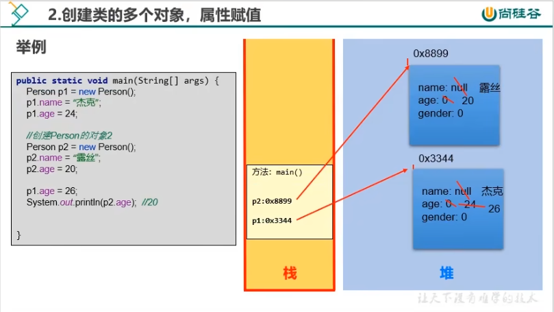

### 对象在内存中的分配涉及到的内存结构（理论）
* 栈（stack）：方法内定义的变量，存储在栈中。
* 堆（heap）：new 出来的结构（比如：数组实体、对象的实体）
* 方法区（method area）：存放类的模板。比如：Person类的模板

### 类中对象的内存解析

#### 创建类的一个对象


#### 创建类的多个对象



* 强调：
创建Person类的两个对象：
```java
Person p1 = new Person();
Person p2 = new Person();
```

* 说明：
创建类的多个对象时，每个对象在堆空间中有一个对象实体。每个对象实体中保存着一份类的属性。
如果修改某一处对象的某属性时，不会影响其他对象此属性的值。
```java
p1.age = 10;
p2.age = 20;

p1.age = 30;
System.out.println(p2.age); // 20
```

* 强调2：
声明类的两个变量
```java
Person p1 = new Person();
Person p3 = new Person();
```
* 说明：
此时的 p1，p2 两个变量指向了堆空间中的一个对象实体。（或者说 p1，p2 保存的地址相同）
如果通过其中某一个对象变量修改对象的属性时，会影响另一个对象变量此属性的值。

```java
p1.age = 10;
p2.age = 20;
System.out.println(p1.age); // 20
```