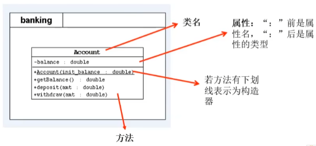

### 类中属性（当前考虑实例变量）赋值过程：
在类的属性中，可以有哪些位置给属性赋值？
1. 默认初始化（默认值）；
2. 显示初始化；
3. 构造器中初始化；
4. 通过 `对象.方法` 的方式赋值；
5. 通过 `对象.属性` 的方式赋值

这些位置执行的先后顺序是怎样？
① - ② - ③ - ④/⑤

以上操作在对象创建过程中可以执行的次数？
* 只能执行一次：①、②、③
* 可以多次执行：④、⑤

### JavaBean的理解
* JavaBean 是一种 Java 语言写成的可重用组件。
  * 好比你做了一个扳手，这个扳手会在很多地方被拿去用。这个扳手也提供多种功能(你可以拿这个扳手扳锤、撬等等)，而这个扳手就是一个组件。
* 所谓 JavaBean，是指符合如下标准的 Java 类:
  * **类是公共的**
  * **有一个无参的公共的构造器**
  * **有属性，且有对应的 get、set 方法**
* 用户可以使用 JavaBean 将功能、处理、值、数据库访问和其他任何可以用 Java 代码创造的对象进行打包，并且其他的开发者可以通过内部的 JSP 页面、Servlet、其他 JavaBean、applet 程序或者应用来使用这些对象。用户可以认为 JavaBean 提供了一种随时随地的复制和粘贴的功能，而不用关心任何改变。
* 《Think in Java》中提到，JavaBean 最初是为 Java GUI 的可视化编程实现的。你拖动 IDE 构建工具创建一个 GUI 组件(如多选框)，其实是工具给你创建 Java 类，并提供将类的属性暴露出来给你修改调整，将事件监听器暴露出来。

### UML类图
* UML(Unified Modeling Language，统一建模语言)，用来描述 **软件模型** 和 **架构** 的图形化语言。
* 常用的 UML 工具软件有 **PowerDesigner**、**Rose** 和 **Enterprise Architect**。
* UML 工具软件不仅可以绘制软件开发中所需的各种图表，还可以生成对应的源代码。
* 在软件开发中，使用 **UML 类图** 可以更加直观地描述类内部结构(类的属性和操作)以及类之间的关系(如关联、依赖、聚合等)。
  * `+` 表示 public 类型，`-` 表示 private 类型，`#` 表示 protected 类型
  * 方法的写法: 方法的类型(`+`、`-`) 方法名(参数名: 参数类型): 返回值类型。
  * 若方法下有下划线表示为构造器。
  * 斜体表示抽象方法或类。

