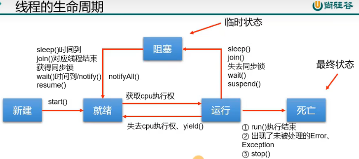
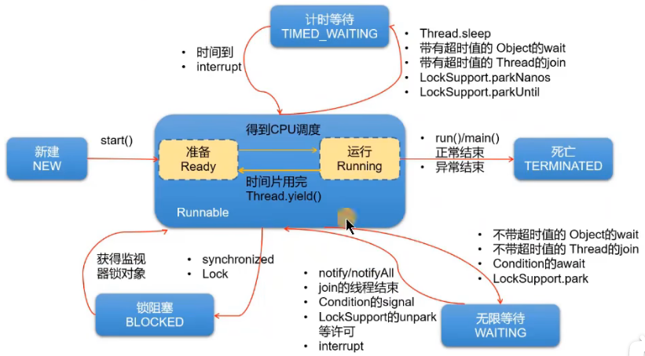

## 线程的常用结构

### 线程中的构造器

* `public Thread()`: 分配一个新的线程对象。
* `public Tread(String name)`: 分配一个指定名字的新的线程对象。
* `public Tread(Runnable target)`: 指定创建线程的目标对象，它实现了 `Runnable` 接口中的 `run` 方法。
* `public Tread(Runnable target, String name)`: 分配一个带有指定目标新的线程对象并指定名字。

### 线程中的常用方法：

* `start()`：① 启动线程 ② 调用线程的 run()
* `run()`：将线程要执行的操作，声明在 run() 中
* `currentThread()`：获取当前执行代码对应的线程
* `getName()`：获取线程的名称
* `setName()`：设置线程名称
* `sleep(long millis)`：静态方法，调用时，可以使得当前线程睡眠指定的毫秒数
* `yield()`：静态方法，一旦执行此方法，就释放 CPU 的执行权
* `join()`：在线程 a 中通过线程 b 调用 join()，意味着线程 a 进入阻塞状态，直到线程 b 执行结束，线程 a 才结束阻塞状态，继续执行。
* `isAlive()`：判断当前线程是否还存活

### 过时的方法(Deprecated)：

* `stop()`：强行结束一个线程的执行，直接进入死亡状态。不建议使用。
* `void suspend()` / `void resume()`：暂停、恢复。可能造成死锁，不建议使用。

### 线程的优先级（java使用的是抢占式调度）：

* `getPriority()`：获取线程的优先级
* `setPriority()`：设置线程的优先级。范围[1,10]

### Thread 类内部声明的三个常量：

* `MAX_PRIORITY`: (10)最高优先级。
* `MIN_PRIORITY`: (1)最低优先级。
* `NORM_PRIORITY`: (5)普通优先级，默认情况下 main 线程具有普通优先级。

## 线程的生命周期

* jdk1.5 之前
    * 线程的生命周期有五种状态：新建（New）、就绪（Runnable）、运行（Running）、阻塞（Blocked）、死亡（Dead）。CPU
      需要在多条线程之间切换，于是线程状态会多次在运行、阻塞、就绪之间切换。
    * 
* jdk1.5 以后
    * NEW、RUNNABLE、BLOCKED、WAITING、TIMED_WAITING、TERMINATED
    * 
