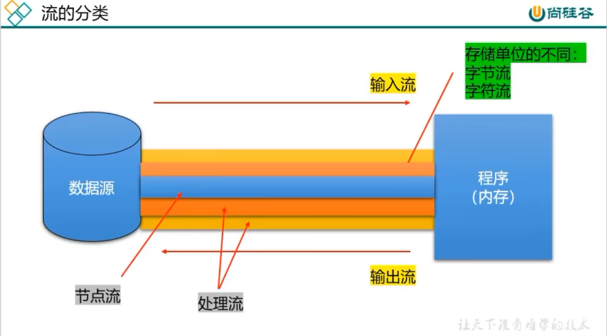

## IO (Input/Output) 流的分类

* 流向的不同：`输入流`、`输出流`
    * 输入流：把数据从 `其他设备` 上读取到`内存` 中的流。（以 `InputStream`、`Reader` 结尾）
    * 输出流：把数据从 `内存` 中写出到 `其他设备` 上的流。（以 `OutputStream`、`Writer` 结尾）
* 处理单位的不同：`字节流`、`字符流`
    * 字节流 (`8 bit`)：以 `字节` 为单位，读写数据的流。（以 `InputStream` 、`OutputStream` 结尾）
    * 字符流 (`16 bit`)：以 `字符` 为单位，读写数据的流。（以 `Reader`、`Writer` 结尾）
* 流的角色不同：`节点流`、`处理流`
    * 节点流：直接从数据源或目的地读写数据
    * 处理流：不直接连接到数据源或目的地，而是连接在已存在的流（节点流或者处理流）之上，通过对数据的处理为程序提供更强大的读写功能。

## 流的分类

* 角度不同，流向不同。例如：`数据源 --> 内存`
    * 从内存角度看，为输入流；
    * 但从数据源角度看，为输出流。
* 我们应站在 `内存` 的角度，避免创建错误的流。

## 基础 IO 流的框架：

|   抽象基类   | 4 个节点流（也称为文件流） |
|:------------:|:--------------------------:|
| InputStream  |      FileInputStream       |
| OutputStream |      FIleOutputStream      |
|    Reader    |         FileReader         |
|    Writer    |         FileWriter         |

## `FileReader`, `FileWriter` 使用

### 执行步骤：

1. 创建读取或写出的 `File` 类的对象
2. 创建输入流或输出流
3. 具体的读入或写出的过程
    * 读入：`read(char[] cBuffer)`
    * 写出：`write(String str)`，`write(char[] cBuffer, int fromIndex, int len)`
4. 关闭流资源，避免内存泄漏

### 注意点

* 因为涉及到流资源的关闭操作，避免流资源没有关闭，需要使用 `try-catch-filally` 的方式来处理异常，确保流资源关闭。
* 对于输入流来讲，要求 `File` 类的对象对应的物理磁盘上的文件必须存在。否则，会报错：FileNotFoundException
* 对于输出流来讲，`File` 类的对象对应的物理磁盘上的文件可以不存在。
    * 如果此文件不存在，则在输出的过程中，会自动创建此文件，并写出数据到此文件中。
    * 如果此文件存在:
        * 使用 `new FileWriter(File file)` 或 `FileWriter(File file, false)`，输出数据过程中，会新建同名的文件对现有的文件进行覆盖。
        * 使用 `new FileWriter(File file, true)`，输出数据过程中，会在现有的文件的末尾追加写入的内容。

## `FileInputStream`, `FileOutputStream` 的使用

### 执行步骤：

1. 创建读取或写出的 `File` 类的对象
2. 创建输入流或输出流
3. 具体的读入或写出的过程

* 读入：`read(byte[] buffer)`
* 写出：`write(byte[] buffer, int fromIndex, int len)`

4. 关闭流资源，避免内存泄漏

### 注意点

* 对于字符流，只能用来操作文本文件，不能用来处理非文本文件的。
* 对于字节流，通常是用来处理非文本文件的。但是，如果涉及到文本文件的复制操作，也可以使用字节流。

